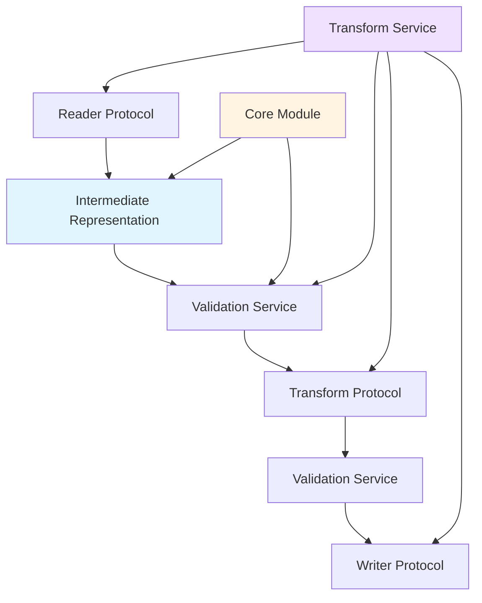
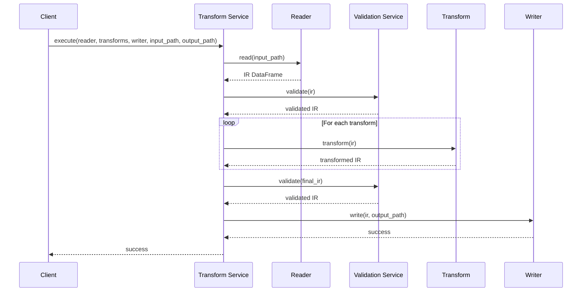

# Design Document: Core Infrastructure

## Overview

The core infrastructure provides the foundational components for fintran's reader → IR → writer pipeline pattern. This design establishes the Intermediate Representation (IR) schema, validation services, pipeline orchestration, protocol definitions, and project scaffolding that all format-specific modules will build upon.

The architecture follows a clean separation of concerns:
- **Core**: Defines the IR schema and provides schema utilities
- **Validation Service**: Ensures IR compliance and rejects malformed data
- **Transform Service**: Orchestrates the complete pipeline flow
- **Protocols**: Define interfaces for Reader, Writer, and Transform implementations

This design aligns with the application architecture defined in `architecture.archimate` and follows the C4 model (Context, Container, Component levels).

## Architecture

### High-Level Architecture



### Component Responsibilities

1. **Core Module** (`fintran/core/`)
   - Defines the canonical IR schema
   - Provides schema creation and inspection utilities
   - Defines custom exception hierarchy
   - Exports protocol definitions

2. **Validation Service** (`fintran/core/validation.py`)
   - Validates DataFrame schema compliance
   - Checks required fields presence
   - Verifies data types
   - Returns descriptive error messages

3. **Transform Service** (`fintran/core/pipeline.py`)
   - Orchestrates reader → transform → writer flow
   - Invokes validation at appropriate checkpoints
   - Handles error propagation with context
   - Ensures immutability guarantees

4. **Protocol Definitions** (`fintran/core/protocols.py`)
   - Reader protocol: file path → IR DataFrame
   - Writer protocol: IR DataFrame + path → file
   - Transform protocol: IR DataFrame → IR DataFrame

### Data Flow



## Components and Interfaces

### IR Schema Definition

The IR schema is the canonical data structure used throughout the pipeline:

```python
# fintran/core/schema.py

import polars as pl
from decimal import Decimal

# IR Schema Definition
IR_SCHEMA = {
    "date": pl.Date,
    "account": pl.Utf8,
    "amount": pl.Decimal,
    "currency": pl.Utf8,
    "description": pl.Utf8,  # Optional
    "reference": pl.Utf8,    # Optional
}

REQUIRED_FIELDS = {"date", "account", "amount", "currency"}
OPTIONAL_FIELDS = {"description", "reference"}

def create_empty_ir() -> pl.DataFrame:
    """Create an empty IR DataFrame with the correct schema."""
    return pl.DataFrame(schema=IR_SCHEMA)

def get_ir_schema() -> dict[str, pl.DataType]:
    """Return the IR schema definition for validation purposes."""
    return IR_SCHEMA.copy()
```

### Validation Service Interface

```python
# fintran/core/validation.py

import polars as pl
from fintran.core.schema import IR_SCHEMA, REQUIRED_FIELDS
from fintran.core.exceptions import ValidationError

def validate_ir(df: pl.DataFrame) -> pl.DataFrame:
    """
    Validate that a DataFrame conforms to the IR schema.
    
    Args:
        df: DataFrame to validate
        
    Returns:
        The same DataFrame if validation succeeds
        
    Raises:
        ValidationError: If validation fails with details about the violation
    """
    # Check required fields presence
    missing_fields = REQUIRED_FIELDS - set(df.columns)
    if missing_fields:
        raise ValidationError(f"Missing required fields: {missing_fields}")
    
    # Check data types
    for field, expected_type in IR_SCHEMA.items():
        if field in df.columns:
            actual_type = df[field].dtype
            if actual_type != expected_type:
                raise ValidationError(
                    f"Field '{field}' has incorrect type. "
                    f"Expected {expected_type}, got {actual_type}"
                )
    
    return df
```

### Protocol Definitions

```python
# fintran/core/protocols.py

from typing import Protocol, Any
from pathlib import Path
import polars as pl

class Reader(Protocol):
    """
    Protocol for format-specific readers.
    
    Implementations must:
    - Parse source files and produce validated IR DataFrames
    - Raise ReaderError for malformed input with descriptive messages
    - Support optional configuration parameters
    """
    
    def read(self, path: Path, **config: Any) -> pl.DataFrame:
        """
        Read a file and return an IR DataFrame.
        
        Args:
            path: Path to the input file
            **config: Format-specific configuration options
            
        Returns:
            Validated IR DataFrame
            
        Raises:
            ReaderError: If parsing fails
        """
        ...

class Writer(Protocol):
    """
    Protocol for format-specific writers.
    
    Implementations must:
    - Validate IR input before writing
    - Serialize IR to target format
    - Raise WriterError for write failures with descriptive messages
    - Support optional configuration parameters
    """
    
    def write(self, df: pl.DataFrame, path: Path, **config: Any) -> None:
        """
        Write an IR DataFrame to a file.
        
        Args:
            df: Validated IR DataFrame
            path: Path to the output file
            **config: Format-specific configuration options
            
        Raises:
            WriterError: If writing fails
        """
        ...

class Transform(Protocol):
    """
    Protocol for IR transformations.
    
    Implementations must:
    - Not mutate the input DataFrame
    - Return validated IR output
    - Be deterministic (same input → same output)
    - Raise TransformError for transformation failures
    """
    
    def transform(self, df: pl.DataFrame) -> pl.DataFrame:
        """
        Transform an IR DataFrame.
        
        Args:
            df: Input IR DataFrame
            
        Returns:
            Transformed IR DataFrame (new instance)
            
        Raises:
            TransformError: If transformation fails
        """
        ...
```

### Pipeline Orchestration

```python
# fintran/core/pipeline.py

from pathlib import Path
from typing import Sequence
import polars as pl

from fintran.core.protocols import Reader, Writer, Transform
from fintran.core.validation import validate_ir
from fintran.core.exceptions import PipelineError

def execute_pipeline(
    reader: Reader,
    writer: Writer,
    input_path: Path,
    output_path: Path,
    transforms: Sequence[Transform] = (),
    **config: Any
) -> None:
    """
    Execute the complete reader → transform → writer pipeline.
    
    Args:
        reader: Reader implementation
        writer: Writer implementation
        input_path: Path to input file
        output_path: Path to output file
        transforms: Sequence of transforms to apply (optional)
        **config: Configuration passed to reader/writer
        
    Raises:
        PipelineError: If any step fails, with context about which step
    """
    try:
        # Step 1: Read
        ir = reader.read(input_path, **config)
        
        # Step 2: Validate reader output
        ir = validate_ir(ir)
        
        # Step 3: Apply transforms
        for i, transform in enumerate(transforms):
            original_id = id(ir)
            ir = transform.transform(ir)
            
            # Verify immutability
            if id(ir) == original_id:
                raise PipelineError(
                    f"Transform {i} violated immutability: "
                    f"returned the same DataFrame instance"
                )
        
        # Step 4: Validate final IR
        ir = validate_ir(ir)
        
        # Step 5: Write
        writer.write(ir, output_path, **config)
        
    except Exception as e:
        # Wrap with context about pipeline step
        raise PipelineError(f"Pipeline failed: {e}") from e
```

### Exception Hierarchy

```python
# fintran/core/exceptions.py

class FintranError(Exception):
    """Base exception for all fintran errors."""
    pass

class ValidationError(FintranError):
    """Raised when IR validation fails."""
    pass

class ReaderError(FintranError):
    """Raised when reading/parsing fails."""
    pass

class WriterError(FintranError):
    """Raised when writing/serialization fails."""
    pass

class TransformError(FintranError):
    """Raised when transformation fails."""
    pass

class PipelineError(FintranError):
    """Raised when pipeline orchestration fails."""
    pass
```

## Data Models

### IR DataFrame Schema

The Intermediate Representation is a Polars DataFrame with the following schema:

| Field | Type | Required | Description |
|-------|------|----------|-------------|
| date | Date | Yes | Transaction date |
| account | Utf8 | Yes | Account identifier |
| amount | Decimal | Yes | Transaction amount |
| currency | Utf8 | Yes | Currency code (e.g., "USD", "EUR") |
| description | Utf8 | No | Transaction description |
| reference | Utf8 | No | Transaction reference number |

**Constraints:**
- Required fields must never be null
- Optional fields may be null
- Schema must remain consistent across all pipeline stages
- DataFrames should be treated as immutable

**Example IR DataFrame:**

```python
import polars as pl
from datetime import date
from decimal import Decimal

ir = pl.DataFrame({
    "date": [date(2024, 1, 15), date(2024, 1, 16)],
    "account": ["1001", "1002"],
    "amount": [Decimal("100.50"), Decimal("-50.25")],
    "currency": ["USD", "USD"],
    "description": ["Payment received", "Service fee"],
    "reference": ["INV-001", None],
})
```

## Project Structure

The project follows a modular structure that supports the architecture:

```
fintran/
├── pyproject.toml           # Project configuration, dependencies, tool configs
├── uv.lock                  # Locked dependencies (managed by uv)
├── .python-version          # Python version specification (3.13+)
├── fintran/
│   ├── __init__.py
│   ├── core/                # Core infrastructure
│   │   ├── __init__.py
│   │   ├── schema.py        # IR schema definition
│   │   ├── validation.py    # Validation service
│   │   ├── pipeline.py      # Pipeline orchestration
│   │   ├── protocols.py     # Protocol definitions
│   │   └── exceptions.py    # Exception hierarchy
│   ├── readers/             # Format-specific readers
│   │   └── __init__.py
│   ├── writers/             # Format-specific writers
│   │   └── __init__.py
│   └── transforms/          # Optional transforms
│       └── __init__.py
├── tests/
│   ├── __init__.py
│   ├── conftest.py          # Pytest fixtures
│   ├── test_schema.py
│   ├── test_validation.py
│   ├── test_pipeline.py
│   └── properties/          # Property-based tests
│       ├── __init__.py
│       ├── test_roundtrip.py
│       ├── test_invariants.py
│       └── test_idempotence.py
└── .pre-commit-config.yaml  # Pre-commit hooks configuration
```

### Development Environment

**Python Version:** Python 3.13+

The project requires Python 3.13 or higher to leverage the latest language features and performance improvements.

**Package Management:** uv

The project uses [uv](https://github.com/astral-sh/uv) for fast, reliable package management and virtual environment handling:

- **Virtual Environment Creation**: uv automatically creates and manages a virtual environment in `.venv/` when you run `uv sync`
- **Dependency Resolution**: uv resolves and locks dependencies in `uv.lock` for reproducible builds
- **Fast Installation**: uv installs packages significantly faster than pip
- **Automatic Activation**: Many uv commands automatically use the project's virtual environment

Common uv commands:
```bash
# Create venv and install dependencies
uv sync

# Add a new dependency
uv add polars

# Add a dev dependency
uv add --dev pytest

# Run a command in the venv
uv run pytest

# Update dependencies
uv lock --upgrade
```

**Configuration File:** pyproject.toml

All project configuration is centralized in `pyproject.toml`:

1. **Project Metadata**
   - Package name, version, description
   - Authors and license information
   - Python version requirement (>=3.13)

2. **Dependencies**
   - Core dependencies: polars, duckdb, cyclopts
   - Development dependencies: pytest, hypothesis, ruff, mypy, pre-commit

3. **Tool Configurations**
   - **ruff**: Linting rules, formatting options, import sorting, line length (88 chars)
   - **mypy**: Type checking strictness, disallow untyped definitions, strict optional
   - **pytest**: Test discovery paths, markers, coverage settings
   - **hypothesis**: Example generation settings, max examples (100+), deadline configuration

4. **Build System**
   - Build backend specification (hatchling or setuptools)
   - Build requirements

Example `pyproject.toml` structure:
```toml
[project]
name = "fintran"
version = "0.1.0"
requires-python = ">=3.13"
dependencies = [
    "polars>=0.20.0",
    "duckdb>=0.10.0",
    "cyclopts>=2.0.0",
]

[project.optional-dependencies]
dev = [
    "pytest>=8.0.0",
    "hypothesis>=6.98.0",
    "ruff>=0.2.0",
    "mypy>=1.8.0",
    "pre-commit>=3.6.0",
]

[tool.ruff]
line-length = 88
target-version = "py313"

[tool.ruff.lint]
select = ["E", "F", "I", "N", "W"]
ignore = []

[tool.mypy]
python_version = "3.13"
strict = true
disallow_untyped_defs = true

[tool.pytest.ini_options]
testpaths = ["tests"]
python_files = ["test_*.py"]
python_classes = ["Test*"]
python_functions = ["test_*"]

[tool.hypothesis]
max_examples = 100
deadline = 500
```


## Correctness Properties

*A property is a characteristic or behavior that should hold true across all valid executions of a system—essentially, a formal statement about what the system should do. Properties serve as the bridge between human-readable specifications and machine-verifiable correctness guarantees.*

### Property 1: Validation Rejects Missing Required Fields

*For any* DataFrame missing one or more required fields (date, account, amount, currency), validation should raise a ValidationError that identifies which required fields are missing.

**Validates: Requirements 2.1, 2.3**

### Property 2: Validation Rejects Incorrect Types

*For any* DataFrame where one or more fields have incorrect data types, validation should raise a ValidationError that identifies the field, expected type, and actual type.

**Validates: Requirements 2.2, 2.4**

### Property 3: Validation Returns Input Unchanged

*For any* valid IR DataFrame, validation should return a DataFrame that is equivalent to the input (same data, same schema).

**Validates: Requirements 2.5**

### Property 4: Validation Is Idempotent

*For any* valid IR DataFrame, validating twice should produce the same result as validating once: `validate(validate(df)) ≈ validate(df)`.

**Validates: Requirements 2.6, 14.1**

### Property 5: Validation Does Not Mutate Input

*For any* DataFrame (valid or invalid), the validation function should not modify the input DataFrame in place.

**Validates: Requirements 14.3**

### Property 6: Round-Trip Preserves Data

*For any* valid IR DataFrame and any reader/writer pair supporting the same format, writing then reading should produce an equivalent DataFrame: `read(write(df)) ≈ df`. All required fields must be preserved exactly, and all optional fields must be preserved when present.

**Validates: Requirements 12.1, 12.3, 12.4**

### Property 7: Transforms Preserve or Reduce Row Count

*For any* Transform implementation and any valid IR DataFrame, the output row count should be less than or equal to the input row count (transforms should not create rows without explicit justification).

**Validates: Requirements 13.1**

### Property 8: Transforms Preserve Required Field Non-Nullness

*For any* Transform implementation and any valid IR DataFrame, all required fields (date, account, amount, currency) in the output should remain non-null.

**Validates: Requirements 13.2**

### Property 9: Transforms Preserve Valid IR Schema

*For any* Transform implementation and any valid IR DataFrame, the output should pass IR validation (schema remains valid).

**Validates: Requirements 13.3**

### Property 10: Transforms Are Deterministic

*For any* Transform implementation and any valid IR DataFrame, applying the same transform multiple times to the same input should produce equivalent results: `transform(df) ≈ transform(df)`.

**Validates: Requirements 5.4, 17.1**

### Property 11: Pipeline Identity Without Transforms

*For any* reader/writer pair and any valid input, a pipeline with no transforms should produce output equivalent to directly connecting the reader to the writer: `pipeline(reader, [], writer, input) ≈ writer(reader(input))`.

**Validates: Requirements 6.8, 15.1**

### Property 12: Invalid DataFrames Are Rejected Safely

*For any* invalid IR DataFrame (missing required fields, wrong types, etc.), validation should raise a ValidationError without crashing the system.

**Validates: Requirements 16.1, 16.4**

### Property 13: Validation Errors Are Descriptive

*For any* invalid IR DataFrame, the ValidationError message should identify the specific validation failure (which field is missing or has wrong type).

**Validates: Requirements 16.3**

### Property 14: Schema Has Exactly Four Required Fields

*For any* valid IR DataFrame, the number of required fields should equal 4 (date, account, amount, currency).

**Validates: Requirements 18.1**

### Property 15: Schema Has Between Four and Six Total Fields

*For any* valid IR DataFrame, the total number of fields should be between 4 and 6 (4 required + 0-2 optional).

**Validates: Requirements 18.2**

## Error Handling

### Exception Hierarchy

All fintran errors inherit from a base `FintranError` exception, providing a consistent error handling interface:

```
FintranError (base)
├── ValidationError (IR schema violations)
├── ReaderError (parsing failures)
├── WriterError (serialization failures)
├── TransformError (transformation failures)
└── PipelineError (orchestration failures)
```

### Error Handling Strategy

1. **Fail Fast**: Validate IR at pipeline boundaries (after read, after transforms)
2. **Descriptive Messages**: All errors include context about what failed and why
3. **Error Propagation**: Pipeline wraps errors with context about which step failed
4. **No Silent Failures**: All errors are raised, never swallowed
5. **Immutability Checks**: Pipeline verifies transforms don't return the same object reference

### Error Context Examples

```python
# Validation error with field details
ValidationError("Missing required fields: {'date', 'amount'}")

# Validation error with type details
ValidationError("Field 'amount' has incorrect type. Expected Decimal, got Float64")

# Pipeline error with step context
PipelineError("Pipeline failed at transform step 2: TransformError(...)")

# Reader error with file context
ReaderError("Failed to parse CSV file '/path/to/file.csv': Invalid date format in row 5")
```

## Testing Strategy

### Dual Testing Approach

The testing strategy combines two complementary approaches:

1. **Unit Tests**: Verify specific examples, edge cases, and error conditions
2. **Property-Based Tests**: Verify universal properties across all inputs

Both are necessary for comprehensive coverage. Unit tests catch concrete bugs and verify specific behaviors, while property-based tests verify general correctness across a wide input space.

### Unit Testing

**Focus Areas:**
- Specific examples demonstrating correct behavior
- Integration points between components (pipeline orchestration)
- Edge cases (empty DataFrames, single-row DataFrames, all-null optional fields)
- Error conditions (specific malformed inputs)

**Example Unit Tests:**
```python
def test_validate_ir_with_valid_dataframe():
    """Verify validation succeeds for a valid IR DataFrame."""
    ir = create_sample_ir()
    result = validate_ir(ir)
    assert result.equals(ir)

def test_validate_ir_missing_date_field():
    """Verify validation fails when date field is missing."""
    ir = pl.DataFrame({
        "account": ["1001"],
        "amount": [Decimal("100.50")],
        "currency": ["USD"],
    })
    with pytest.raises(ValidationError, match="Missing required fields.*date"):
        validate_ir(ir)

def test_pipeline_with_no_transforms():
    """Verify pipeline correctly handles zero transforms."""
    reader = MockReader()
    writer = MockWriter()
    execute_pipeline(reader, writer, Path("in.csv"), Path("out.csv"))
    assert writer.was_called
```

### Property-Based Testing

**Configuration:**
- Library: Hypothesis (Python property-based testing library)
- Minimum iterations: 100 per property test
- Each test references its design document property via comment tag

**Tag Format:**
```python
# Feature: core-infrastructure, Property 4: Validation Is Idempotent
@given(valid_ir_dataframe())
def test_validation_idempotence(df):
    result1 = validate_ir(df)
    result2 = validate_ir(result1)
    assert result1.equals(result2)
```

**Property Test Focus:**
- Universal properties that hold for all inputs
- Comprehensive input coverage through randomization
- Invariants that must be preserved
- Round-trip properties
- Metamorphic properties

**Hypothesis Strategies:**

Custom strategies for generating test data:

```python
from hypothesis import given, strategies as st
from hypothesis.extra.pandas import data_frames, column

@st.composite
def valid_ir_dataframe(draw):
    """Generate random valid IR DataFrames."""
    size = draw(st.integers(min_value=0, max_value=100))
    return pl.DataFrame({
        "date": draw(st.lists(st.dates(), min_size=size, max_size=size)),
        "account": draw(st.lists(st.text(min_size=1), min_size=size, max_size=size)),
        "amount": draw(st.lists(st.decimals(allow_nan=False), min_size=size, max_size=size)),
        "currency": draw(st.lists(st.sampled_from(["USD", "EUR", "GBP"]), min_size=size, max_size=size)),
        "description": draw(st.lists(st.none() | st.text(), min_size=size, max_size=size)),
        "reference": draw(st.lists(st.none() | st.text(), min_size=size, max_size=size)),
    })

@st.composite
def invalid_ir_dataframe(draw):
    """Generate random invalid IR DataFrames."""
    # Randomly choose what to make invalid
    choice = draw(st.sampled_from(["missing_field", "wrong_type"]))
    if choice == "missing_field":
        # Create DataFrame missing a required field
        fields = ["date", "account", "amount", "currency"]
        missing = draw(st.sampled_from(fields))
        return create_ir_without_field(missing)
    else:
        # Create DataFrame with wrong type
        return create_ir_with_wrong_type()
```

**Example Property Tests:**

```python
# Feature: core-infrastructure, Property 4: Validation Is Idempotent
@given(valid_ir_dataframe())
@settings(max_examples=100)
def test_validation_idempotence(df):
    """Verify validation is idempotent for all valid DataFrames."""
    result1 = validate_ir(df)
    result2 = validate_ir(result1)
    assert result1.equals(result2)

# Feature: core-infrastructure, Property 1: Validation Rejects Missing Required Fields
@given(invalid_ir_dataframe())
@settings(max_examples=100)
def test_validation_rejects_missing_fields(df):
    """Verify validation rejects DataFrames missing required fields."""
    with pytest.raises(ValidationError):
        validate_ir(df)

# Feature: core-infrastructure, Property 10: Transforms Are Deterministic
@given(valid_ir_dataframe())
@settings(max_examples=100)
def test_transform_determinism(df):
    """Verify transforms produce consistent results."""
    transform = IdentityTransform()
    result1 = transform.transform(df)
    result2 = transform.transform(df)
    assert result1.equals(result2)
```

### Test Organization

```
tests/
├── conftest.py                    # Pytest fixtures and Hypothesis strategies
├── test_schema.py                 # Unit tests for schema utilities
├── test_validation.py             # Unit tests for validation service
├── test_pipeline.py               # Unit tests for pipeline orchestration
├── test_protocols.py              # Unit tests for protocol definitions
├── test_exceptions.py             # Unit tests for exception hierarchy
└── properties/                    # Property-based tests
    ├── test_validation_properties.py
    ├── test_transform_properties.py
    ├── test_pipeline_properties.py
    └── test_roundtrip_properties.py
```

### Test Fixtures

Common fixtures for test setup:

```python
# tests/conftest.py

import pytest
import polars as pl
from decimal import Decimal
from datetime import date

@pytest.fixture
def sample_ir():
    """Create a sample IR DataFrame for testing."""
    return pl.DataFrame({
        "date": [date(2024, 1, 15), date(2024, 1, 16)],
        "account": ["1001", "1002"],
        "amount": [Decimal("100.50"), Decimal("-50.25")],
        "currency": ["USD", "USD"],
        "description": ["Payment received", "Service fee"],
        "reference": ["INV-001", None],
    })

@pytest.fixture
def empty_ir():
    """Create an empty IR DataFrame with correct schema."""
    return create_empty_ir()

@pytest.fixture
def mock_reader():
    """Create a mock reader for testing."""
    class MockReader:
        def read(self, path, **config):
            return create_empty_ir()
    return MockReader()

@pytest.fixture
def mock_writer():
    """Create a mock writer for testing."""
    class MockWriter:
        def __init__(self):
            self.was_called = False
            self.received_df = None
        
        def write(self, df, path, **config):
            self.was_called = True
            self.received_df = df
    return MockWriter()
```

### Coverage Goals

- **Line Coverage**: Minimum 90% for core modules
- **Branch Coverage**: Minimum 85% for error handling paths
- **Property Coverage**: All 15 correctness properties must have corresponding property tests
- **Integration Coverage**: All pipeline paths (with/without transforms, error cases) must be tested

### Continuous Integration

Tests run automatically on:
- Pre-commit hooks (fast unit tests only)
- Pull request CI (full test suite including property tests)
- Main branch CI (full test suite + coverage reporting)

