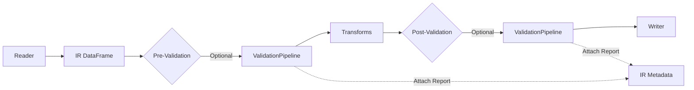
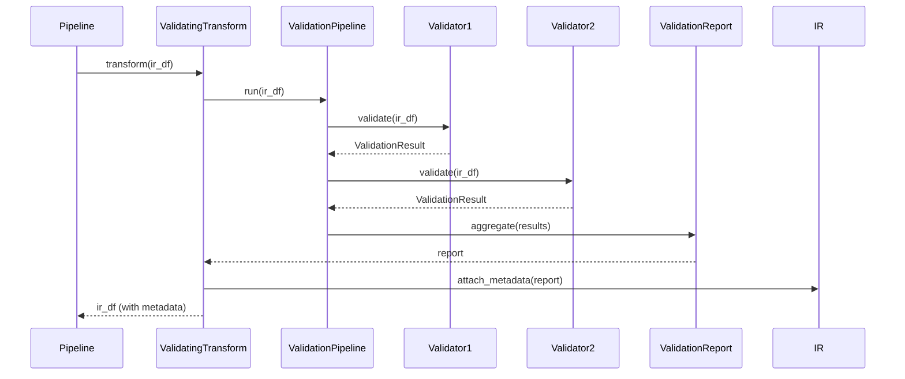

# Design Document: Data Validation Framework

## Overview

The Data Validation Framework extends the fintran pipeline with comprehensive validation capabilities beyond basic IR schema validation. The framework provides business rule validation, data quality checks, custom validation rules, and detailed validation reporting while maintaining the property-based testing approach established in the core infrastructure.

### Design Goals

1. **Composability**: Validators can be combined into pipelines and reused across projects
2. **Declarative Configuration**: Validation rules can be defined in Python or YAML for readability
3. **Performance**: Leverage Polars vectorized operations for efficient validation at scale
4. **Integration**: Seamlessly integrate with the existing reader → IR → writer pipeline
5. **Testability**: All validators are property-based testable with clear correctness properties

### Key Capabilities

- **Business Rule Validation**: Enforce domain-specific constraints (positive amounts, currency consistency, date ranges)
- **Data Quality Checks**: Detect duplicates, missing values, outliers, and inconsistencies
- **Custom Validators**: Define project-specific validation rules with a consistent interface
- **Validation Reporting**: Generate comprehensive reports with actionable error messages
- **Pipeline Integration**: Run validation at any pipeline stage (pre-transform, post-transform)
- **Metadata Preservation**: Store validation results in IR metadata for downstream access

## Architecture

### Component Overview

The validation framework introduces a new `validation` module within the fintran package structure:

```
fintran/
├── core/              # Existing core infrastructure
│   ├── schema.py      # IR schema and basic validation
│   ├── protocols.py   # Reader, Writer, Transform protocols
│   ├── pipeline.py    # Pipeline orchestration
│   └── exceptions.py  # Exception hierarchy
├── validation/        # NEW: Validation framework
│   ├── __init__.py
│   ├── protocols.py   # Validator protocol
│   ├── result.py      # ValidationResult data structure
│   ├── pipeline.py    # ValidationPipeline orchestration
│   ├── report.py      # ValidationReport aggregation
│   ├── transform.py   # ValidatingTransform for pipeline integration
│   ├── business/      # Business rule validators
│   │   ├── __init__.py
│   │   ├── amounts.py
│   │   ├── currency.py
│   │   └── dates.py
│   ├── quality/       # Data quality validators
│   │   ├── __init__.py
│   │   ├── duplicates.py
│   │   ├── missing.py
│   │   └── outliers.py
│   ├── custom.py      # Custom validator helpers
│   ├── declarative.py # Declarative rule parsing
│   └── exceptions.py  # Validation-specific exceptions
└── ...
```

### Integration with Existing Pipeline

The validation framework integrates at multiple points in the pipeline:



**Integration Points:**

1. **Pre-Validation**: Validate raw data immediately after reading, before any transforms
2. **Post-Validation**: Validate transformed data before writing to ensure transforms maintain data quality
3. **Transform Integration**: Use `ValidatingTransform` to embed validation as a pipeline step
4. **Metadata Storage**: Validation reports are stored in IR metadata and preserved through Parquet serialization

### Data Flow



## Components and Interfaces

### Validator Protocol

The `Validator` protocol defines the interface that all validators must implement:

```python
from typing import Protocol
import polars as pl
from fintran.validation.result import ValidationResult

class Validator(Protocol):
    """Protocol for validation implementations.
    
    All validators must:
    - Accept an IR DataFrame as input
    - Return a ValidationResult indicating success or failure
    - Not mutate the input DataFrame
    - Be deterministic (same input produces same result)
    """
    
    def validate(self, df: pl.DataFrame) -> ValidationResult:
        """Validate an IR DataFrame.
        
        Args:
            df: IR DataFrame to validate (must not be mutated)
            
        Returns:
            ValidationResult with validation outcome
            
        Raises:
            ValidationError: If validation logic itself fails (not data validation failure)
        """
        ...
```

**Key Properties:**
- **Immutability**: Validators must not modify the input DataFrame
- **Determinism**: Same input always produces same ValidationResult
- **Composability**: Validators can be combined in ValidationPipelines

### ValidationResult Data Structure

```python
from dataclasses import dataclass, field
from typing import Any

@dataclass
class ValidationResult:
    """Result of a validation check.
    
    Attributes:
        is_valid: True if validation passed (no errors)
        errors: List of error messages (validation failures)
        warnings: List of warning messages (data quality issues)
        validator_name: Name of the validator that produced this result
        metadata: Additional context (row indices, field names, statistics)
    """
    
    is_valid: bool
    errors: list[str] = field(default_factory=list)
    warnings: list[str] = field(default_factory=list)
    validator_name: str = ""
    metadata: dict[str, Any] = field(default_factory=dict)
    
    def has_errors(self) -> bool:
        """Check if validation failed with errors."""
        return len(self.errors) > 0
    
    def has_warnings(self) -> bool:
        """Check if validation has warnings."""
        return len(self.warnings) > 0
    
    def format(self) -> str:
        """Format result as human-readable string."""
        ...
    
    @staticmethod
    def combine(results: list["ValidationResult"]) -> "ValidationResult":
        """Combine multiple results into an aggregated result."""
        ...
```

### ValidationPipeline

```python
from collections.abc import Sequence
from enum import Enum

class ValidationMode(Enum):
    """Validation pipeline execution mode."""
    FAIL_FAST = "fail_fast"  # Stop on first error
    CONTINUE = "continue"     # Run all validators regardless of failures

class ValidationPipeline:
    """Orchestrates execution of multiple validators.
    
    The pipeline applies validators in sequence and aggregates results
    into a ValidationReport. Supports fail-fast and continue modes.
    """
    
    def __init__(
        self,
        validators: Sequence[Validator],
        mode: ValidationMode = ValidationMode.CONTINUE,
    ):
        """Initialize validation pipeline.
        
        Args:
            validators: Sequence of validators to apply
            mode: Execution mode (fail-fast or continue)
        """
        self.validators = validators
        self.mode = mode
    
    def run(self, df: pl.DataFrame) -> ValidationReport:
        """Run all validators and aggregate results.
        
        Args:
            df: IR DataFrame to validate
            
        Returns:
            ValidationReport with aggregated results
        """
        ...
```

### ValidationReport

```python
from dataclasses import dataclass
from datetime import datetime

@dataclass
class ValidationReport:
    """Aggregated report of validation results.
    
    Attributes:
        results: List of individual ValidationResults
        timestamp: When validation was performed
        total_validators: Total number of validators run
        passed: Number of validators that passed
        failed: Number of validators that failed
        warnings_count: Total number of warnings across all validators
    """
    
    results: list[ValidationResult]
    timestamp: datetime
    total_validators: int
    passed: int
    failed: int
    warnings_count: int
    
    def is_valid(self) -> bool:
        """Check if all validations passed (no errors)."""
        return self.failed == 0
    
    def summary(self) -> str:
        """Generate summary string."""
        ...
    
    def to_json(self) -> dict[str, Any]:
        """Export report as JSON for programmatic access."""
        ...
    
    def format(self, severity_filter: str | None = None) -> str:
        """Format report as human-readable text.
        
        Args:
            severity_filter: Filter by "errors", "warnings", or None for all
        """
        ...
```

### ValidatingTransform

```python
from fintran.core.protocols import Transform

class ValidatingTransform:
    """Transform wrapper that runs validation and attaches results to IR metadata.
    
    This class integrates validation into the pipeline as a Transform,
    allowing validation to run at any pipeline stage.
    """
    
    def __init__(
        self,
        pipeline: ValidationPipeline,
        fail_on_error: bool = False,
        metadata_key: str = "validation_report",
    ):
        """Initialize validating transform.
        
        Args:
            pipeline: ValidationPipeline to execute
            fail_on_error: If True, raise ValidationError on failures
            metadata_key: Key to use for storing report in IR metadata
        """
        self.pipeline = pipeline
        self.fail_on_error = fail_on_error
        self.metadata_key = metadata_key
    
    def transform(self, df: pl.DataFrame) -> pl.DataFrame:
        """Run validation and attach report to IR metadata.
        
        Args:
            df: IR DataFrame to validate
            
        Returns:
            IR DataFrame with validation report in metadata
            
        Raises:
            ValidationError: If fail_on_error=True and validation fails
        """
        ...
```

## Data Models

### IR Metadata Extension

The validation framework extends IR metadata to store validation reports:

```python
# IR metadata structure (stored in Polars DataFrame metadata)
{
    "validation_reports": [
        {
            "stage": "pre_transform",  # or "post_transform"
            "timestamp": "2024-01-15T10:30:00Z",
            "report": {
                "total_validators": 5,
                "passed": 4,
                "failed": 1,
                "warnings_count": 2,
                "results": [...]
            }
        }
    ]
}
```

### Declarative Validation Configuration

Validation rules can be defined declaratively in Python dictionaries or YAML:

```python
# Python dictionary format
validation_config = {
    "validators": [
        {
            "type": "positive_amounts",
            "params": {
                "account_patterns": ["^4[0-9]{3}"]  # Revenue accounts
            },
            "severity": "error"
        },
        {
            "type": "currency_consistency",
            "params": {
                "group_by": ["account"]
            },
            "severity": "error"
        },
        {
            "type": "detect_duplicates",
            "params": {
                "fields": ["date", "account", "reference"],
                "mode": "exact"
            },
            "severity": "warning"
        }
    ],
    "mode": "continue"
}
```

```yaml
# YAML format
validators:
  - type: positive_amounts
    params:
      account_patterns:
        - "^4[0-9]{3}"
    severity: error
    
  - type: currency_consistency
    params:
      group_by:
        - account
    severity: error
    
  - type: detect_duplicates
    params:
      fields:
        - date
        - account
        - reference
      mode: exact
    severity: warning

mode: continue
```

## Built-in Validator Implementations

### Business Rule Validators

#### PositiveAmountsValidator

```python
class PositiveAmountsValidator:
    """Validates that amounts are positive for specified accounts.
    
    Use case: Revenue accounts should have positive amounts.
    """
    
    def __init__(self, account_patterns: list[str]):
        """Initialize validator.
        
        Args:
            account_patterns: List of regex patterns for account matching
        """
        self.account_patterns = account_patterns
    
    def validate(self, df: pl.DataFrame) -> ValidationResult:
        """Check that amounts are positive for matching accounts.
        
        Uses Polars vectorized operations for performance:
        1. Filter rows matching account patterns
        2. Check if any amounts are <= 0
        3. Collect error details if violations found
        """
        ...
```

#### CurrencyConsistencyValidator

```python
class CurrencyConsistencyValidator:
    """Validates currency consistency within account groups.
    
    Use case: All transactions for the same account should use the same currency.
    """
    
    def __init__(self, group_by: list[str] | None = None):
        """Initialize validator.
        
        Args:
            group_by: Fields to group by (default: ["account"])
        """
        self.group_by = group_by or ["account"]
    
    def validate(self, df: pl.DataFrame) -> ValidationResult:
        """Check currency consistency within groups.
        
        Uses Polars group_by and aggregation:
        1. Group by specified fields
        2. Count distinct currencies per group
        3. Identify groups with multiple currencies
        """
        ...
```

#### DateRangeValidator

```python
class DateRangeValidator:
    """Validates that transaction dates fall within expected ranges.
    
    Use case: Detect data entry errors with out-of-range dates.
    """
    
    def __init__(
        self,
        min_date: date | None = None,
        max_date: date | None = None,
    ):
        """Initialize validator.
        
        Args:
            min_date: Minimum allowed date (inclusive)
            max_date: Maximum allowed date (inclusive)
        """
        self.min_date = min_date
        self.max_date = max_date
    
    def validate(self, df: pl.DataFrame) -> ValidationResult:
        """Check that all dates are within range.
        
        Uses Polars boolean expressions:
        1. Create mask for out-of-range dates
        2. Filter violations
        3. Collect row indices and dates
        """
        ...
```

### Data Quality Validators

#### DuplicateDetectionValidator

```python
class DuplicateDetectionValidator:
    """Detects duplicate transactions based on specified fields.
    
    Use case: Identify potential duplicate data entry.
    """
    
    def __init__(
        self,
        fields: list[str],
        mode: str = "exact",  # "exact" or "fuzzy"
    ):
        """Initialize validator.
        
        Args:
            fields: Fields to check for uniqueness
            mode: Matching mode (exact or fuzzy)
        """
        self.fields = fields
        self.mode = mode
    
    def validate(self, df: pl.DataFrame) -> ValidationResult:
        """Detect duplicate rows.
        
        Uses Polars is_duplicated():
        1. Mark duplicate rows based on fields
        2. Collect duplicate row indices
        3. Return as warnings (not errors)
        """
        ...
```

#### MissingValueDetectionValidator

```python
class MissingValueDetectionValidator:
    """Detects missing values in optional fields.
    
    Use case: Assess data completeness for optional fields.
    """
    
    def __init__(self, fields: list[str]):
        """Initialize validator.
        
        Args:
            fields: Fields to check for missing values
        """
        self.fields = fields
    
    def validate(self, df: pl.DataFrame) -> ValidationResult:
        """Detect missing values and calculate percentages.
        
        Uses Polars null_count():
        1. Count nulls per field
        2. Calculate percentage missing
        3. Return as warnings with statistics
        """
        ...
```

#### OutlierDetectionValidator

```python
class OutlierDetectionValidator:
    """Detects outlier amounts using statistical methods.
    
    Use case: Flag unusual transactions for review.
    """
    
    def __init__(
        self,
        method: str = "zscore",  # "zscore", "iqr", or "percentile"
        threshold: float = 3.0,
    ):
        """Initialize validator.
        
        Args:
            method: Outlier detection method
            threshold: Threshold for outlier detection (method-specific)
        """
        self.method = method
        self.threshold = threshold
    
    def validate(self, df: pl.DataFrame) -> ValidationResult:
        """Detect outlier amounts.
        
        Uses Polars statistical functions:
        1. Calculate statistics (mean, std, quartiles)
        2. Identify outliers based on method
        3. Return as warnings with outlier details
        """
        ...
```

### Custom Validator Support

```python
from fintran.validation.protocols import Validator
from fintran.validation.result import ValidationResult

def custom_validator(name: str):
    """Decorator for creating custom validators.
    
    Usage:
        @custom_validator("balance_check")
        def validate_balance(df: pl.DataFrame) -> ValidationResult:
            # Custom validation logic
            debits = df.filter(pl.col("amount") < 0)["amount"].sum()
            credits = df.filter(pl.col("amount") > 0)["amount"].sum()
            
            if abs(debits + credits) > 0.01:
                return ValidationResult(
                    is_valid=False,
                    errors=[f"Debits and credits don't balance: {debits} + {credits}"],
                    validator_name="balance_check"
                )
            
            return ValidationResult(
                is_valid=True,
                validator_name="balance_check"
            )
    """
    def decorator(func):
        func.validator_name = name
        return func
    return decorator
```

## Usage Examples

### Basic Validation Pipeline

```python
from fintran.validation.pipeline import ValidationPipeline, ValidationMode
from fintran.validation.business import PositiveAmountsValidator, CurrencyConsistencyValidator
from fintran.validation.quality import DuplicateDetectionValidator

# Create validators
validators = [
    PositiveAmountsValidator(account_patterns=["^4[0-9]{3}"]),
    CurrencyConsistencyValidator(group_by=["account"]),
    DuplicateDetectionValidator(fields=["date", "account", "reference"]),
]

# Create pipeline
pipeline = ValidationPipeline(validators, mode=ValidationMode.CONTINUE)

# Run validation
report = pipeline.run(ir_dataframe)

# Check results
if report.is_valid():
    print("All validations passed!")
else:
    print(report.format())
```

### Integration with Pipeline

```python
from fintran.core.pipeline import execute_pipeline
from fintran.validation.transform import ValidatingTransform
from fintran.validation.pipeline import ValidationPipeline

# Create validation pipeline
validation_pipeline = ValidationPipeline(validators)

# Wrap as transform
validating_transform = ValidatingTransform(
    pipeline=validation_pipeline,
    fail_on_error=True,  # Raise error if validation fails
)

# Use in pipeline
execute_pipeline(
    reader=csv_reader,
    writer=parquet_writer,
    input_path=Path("input.csv"),
    output_path=Path("output.parquet"),
    transforms=[validating_transform],  # Validation as a transform
)
```

### Declarative Configuration

```python
from fintran.validation.declarative import load_validation_config

# Load from YAML
config = load_validation_config("validation_rules.yaml")

# Create pipeline from config
pipeline = config.to_pipeline()

# Run validation
report = pipeline.run(ir_dataframe)
```

### Accessing Validation Metadata

```python
from fintran.validation.metadata import get_validation_reports

# Read IR from Parquet
ir = pl.read_parquet("output.parquet")

# Retrieve validation reports from metadata
reports = get_validation_reports(ir)

for report in reports:
    print(f"Stage: {report['stage']}")
    print(f"Timestamp: {report['timestamp']}")
    print(f"Passed: {report['report']['passed']}/{report['report']['total_validators']}")
```


## Correctness Properties

A property is a characteristic or behavior that should hold true across all valid executions of a system—essentially, a formal statement about what the system should do. Properties serve as the bridge between human-readable specifications and machine-verifiable correctness guarantees.

### Property Reflection

After analyzing all acceptance criteria, I identified the following redundancies:

- **Redundancy 1**: Requirements 3.2, 3.3, and 3.4 all test positive amounts validation. These can be combined into a single comprehensive property that tests both detection and success cases.
- **Redundancy 2**: Requirements 4.2, 4.3, 4.4, and 4.5 all test currency consistency. These can be combined into a single property that covers all cases.
- **Redundancy 3**: Requirements 5.2, 5.3, and 5.4 all test date range validation. These can be combined into a single property.
- **Redundancy 4**: Requirements 6.2, 6.3, and 6.4 all test duplicate detection. These can be combined into a single property.
- **Redundancy 5**: Requirements 7.2, 7.3, and 7.4 all test missing value detection. These can be combined into a single property.
- **Redundancy 6**: Requirements 8.2, 8.3, and 8.4 all test outlier detection. These can be combined into a single property.
- **Redundancy 7**: Requirements 1.5 and 17.1 are identical (validator determinism).
- **Redundancy 8**: Requirements 16.1, 16.2, and 16.3 all test error message content. These can be combined into a single property.
- **Redundancy 9**: Requirements 12.3 and 12.4 test fail-fast vs continue modes. These can be combined into a single property about mode behavior.
- **Redundancy 10**: Requirements 22.1, 22.2, and 22.3 all test metadata attachment and retrieval. These can be combined into a single round-trip property.

### Property 1: Validator Determinism

For any validator and any IR DataFrame, applying the same validator twice to the same input should produce equivalent ValidationResults (same is_valid status, same errors, same warnings).

**Validates: Requirements 1.5, 17.1**

### Property 2: ValidationResult Combination Preserves Information

For any list of ValidationResults, combining them into an aggregated result should preserve all errors and warnings from the individual results, and the aggregated is_valid status should be false if any individual result has errors.

**Validates: Requirements 2.5**

### Property 3: Positive Amounts Validation Detects Violations

For any IR DataFrame and any account pattern, the positive_amounts validator should return errors if and only if there exist rows matching the pattern with amounts <= 0, and the errors should identify the specific row indices and account names.

**Validates: Requirements 3.2, 3.3, 3.4**

### Property 4: Currency Consistency Validation

For any IR DataFrame and any grouping specification, the currency_consistency validator should return errors if and only if there exist groups with multiple distinct currencies, and the errors should identify the account groups and conflicting currencies.

**Validates: Requirements 4.2, 4.3, 4.4, 4.5**

### Property 5: Date Range Validation

For any IR DataFrame and any date range boundaries (min, max, or both), the date_range validator should return errors if and only if there exist dates outside the specified range, and the errors should identify the row indices and out-of-range dates.

**Validates: Requirements 5.2, 5.3, 5.4, 5.5**

### Property 6: Duplicate Detection

For any IR DataFrame and any list of fields, the detect_duplicates validator should return warnings if and only if there exist rows with duplicate values across the specified fields, and the warnings should identify the duplicate row indices.

**Validates: Requirements 6.2, 6.3, 6.4**

### Property 7: Duplicate Detection Mode Consistency

For any IR DataFrame with exact duplicates, both exact and fuzzy match modes should detect the duplicates (fuzzy is a superset of exact).

**Validates: Requirements 6.5**

### Property 8: Missing Value Detection

For any IR DataFrame and any list of fields, the detect_missing validator should return warnings if and only if there exist null or empty values in the specified fields, and the warnings should include the field names, count, and percentage of missing values.

**Validates: Requirements 7.2, 7.3, 7.4, 7.5**

### Property 9: Outlier Detection

For any IR DataFrame and any outlier detection method with threshold, the detect_outliers validator should return warnings if and only if there exist amounts outside the statistical bounds, and the warnings should identify the row indices and outlier amounts.

**Validates: Requirements 8.2, 8.3, 8.4**

### Property 10: Outlier Detection Method Consistency

For any IR DataFrame with extreme outliers (e.g., 10+ standard deviations from mean), all outlier detection methods (z-score, IQR, percentile) should detect them.

**Validates: Requirements 8.5**

### Property 11: ValidationPipeline Execution Order

For any ValidationPipeline with multiple validators, the validators should be applied in the order they were added to the pipeline, and all ValidationResults should be included in the final ValidationReport in the same order.

**Validates: Requirements 10.2, 10.3**

### Property 12: ValidationPipeline Fail-Fast Mode

For any ValidationPipeline in fail-fast mode, if a validator returns errors, subsequent validators should not be executed, and the ValidationReport should only contain results up to and including the first failure.

**Validates: Requirements 10.4**

### Property 13: ValidationPipeline Continue Mode

For any ValidationPipeline in continue mode, all validators should be executed regardless of failures, and the ValidationReport should contain results from all validators.

**Validates: Requirements 10.4, 12.4**

### Property 14: ValidationPipeline Identity

For any IR DataFrame, a ValidationPipeline with no validators should return a ValidationReport indicating success (is_valid=True, no errors, no warnings).

**Validates: Requirements 10.6**

### Property 15: ValidationReport Summary Accuracy

For any ValidationReport, the summary counts (total_validators, passed, failed, warnings_count) should accurately reflect the aggregated ValidationResults.

**Validates: Requirements 11.2**

### Property 16: ValidationReport JSON Round-Trip

For any ValidationReport, exporting to JSON and reconstructing should produce an equivalent ValidationReport with the same summary and results.

**Validates: Requirements 11.4**

### Property 17: ValidationReport Filtering

For any ValidationReport, filtering by severity (errors only, warnings only, all) should return only the results matching the specified severity level.

**Validates: Requirements 11.6**

### Property 18: ValidatingTransform Metadata Attachment

For any ValidationPipeline and any IR DataFrame, applying a ValidatingTransform should attach the ValidationReport to the IR metadata, and the report should be retrievable from the metadata.

**Validates: Requirements 12.2, 22.1, 22.3**

### Property 19: ValidatingTransform Fail-Fast Error Handling

For any ValidationPipeline that produces errors and any IR DataFrame, a ValidatingTransform with fail_on_error=True should raise a ValidationError containing the ValidationReport.

**Validates: Requirements 12.3**

### Property 20: Declarative Configuration Parsing

For any valid declarative validation configuration (dict or YAML), parsing should produce a ValidationPipeline that behaves equivalently to a manually constructed pipeline with the same validators and configuration.

**Validates: Requirements 13.3**

### Property 21: ValidationRuleSet Composition

For any list of ValidationRuleSets, composing them into a single ValidationPipeline should produce a pipeline that applies all validators from all rule sets in the order they were composed.

**Validates: Requirements 14.3**

### Property 22: Validation Performance Linearity

For any validator and any IR DataFrame, doubling the DataFrame size should approximately double the validation time (within a constant factor), demonstrating O(n) complexity.

**Validates: Requirements 15.5**

### Property 23: Error Message Completeness

For any validation error, the error message should contain the validator name, affected row indices or count, and specific field names and values that failed validation.

**Validates: Requirements 16.1, 16.2, 16.3**

### Property 24: Validator Immutability

For any validator and any IR DataFrame, validation should not modify the input DataFrame (both reference equality and content equality should be preserved).

**Validates: Requirements 18.1**

### Property 25: Validator Composition Commutativity

For any set of independent validators (validators checking different properties) and any IR DataFrame, the order of validators should not affect the final set of errors and warnings in the ValidationReport (though the order of results may differ).

**Validates: Requirements 19.1**

### Property 26: Known Failure Detection

For any validator and any IR DataFrame with a known validation failure, the validator should detect the failure and return a ValidationResult with appropriate errors or warnings.

**Validates: Requirements 20.1**

### Property 27: Metadata Preservation Through Parquet

For any IR DataFrame with validation metadata, writing to Parquet and reading back should preserve the validation metadata (round-trip property).

**Validates: Requirements 22.2, 22.4, 22.5**

### Property 28: Configuration Schema Validation

For any invalid declarative validation configuration, loading the configuration should raise a descriptive error identifying the specific schema violation (validator name, parameter type, or required field).

**Validates: Requirements 23.2, 23.3**

## Error Handling

### Exception Hierarchy

The validation framework extends the existing exception hierarchy:

```python
FintranError (base)
├── ValidationError (existing - schema violations)
└── ValidatorError (new - validator execution failures)
    ├── ValidatorConfigurationError (invalid validator configuration)
    ├── ValidatorExecutionError (validator logic failure)
    └── ConfigurationSchemaError (invalid declarative configuration)
```

### Error Scenarios

1. **Invalid Validator Configuration**: Raised when a validator is initialized with invalid parameters
   - Example: `PositiveAmountsValidator(account_patterns=None)` → `ValidatorConfigurationError`

2. **Validator Execution Failure**: Raised when validator logic encounters an unexpected error
   - Example: Validator tries to access a non-existent field → `ValidatorExecutionError`

3. **Invalid Declarative Configuration**: Raised when loading declarative rules with schema violations
   - Example: Missing required field in YAML → `ConfigurationSchemaError`

4. **Validation Failure in Fail-Fast Mode**: Raised when validation fails and `fail_on_error=True`
   - Example: ValidatingTransform with errors → `ValidationError` with attached report

### Error Message Format

All validation errors follow a consistent format:

```
[ValidatorName] Validation failed: <summary>
  - Error 1: <description> (rows: [1, 5, 10])
  - Error 2: <description> (field: amount, account: 4001)
  
Suggestion: <actionable fix>
```

Example:

```
[PositiveAmountsValidator] Validation failed: Found 3 negative amounts in revenue accounts
  - Error: Account 4001 has negative amount -150.00 (row: 5)
  - Error: Account 4002 has negative amount -75.50 (row: 12)
  - Error: Account 4001 has zero amount 0.00 (row: 18)
  
Suggestion: Revenue accounts (4xxx) should have positive amounts. Check for data entry errors or incorrect account codes.
```

## Testing Strategy

### Dual Testing Approach

The validation framework uses both unit tests and property-based tests:

**Unit Tests**: Focus on specific examples, edge cases, and integration points
- Specific validator configurations with known inputs/outputs
- Edge cases: empty DataFrames, single-row DataFrames, null values
- Integration: ValidatingTransform in pipeline, metadata attachment
- Error handling: invalid configurations, execution failures

**Property-Based Tests**: Verify universal properties across all inputs
- Minimum 100 iterations per property test (configured in pytest)
- Each property test references its design document property
- Tag format: `# Feature: data-validation-framework, Property N: <property text>`

### Property-Based Testing Configuration

The framework uses Hypothesis for property-based testing:

```python
from hypothesis import given, settings
from hypothesis import strategies as st

# Configure Hypothesis for validation tests
@given(valid_ir_dataframe(), st.lists(st.sampled_from(validators)))
@settings(max_examples=100, deadline=None)
def test_validator_determinism(df: pl.DataFrame, validators: list[Validator]) -> None:
    """Feature: data-validation-framework, Property 1: Validator Determinism
    
    For any validator and any IR DataFrame, applying the same validator 
    twice should produce equivalent results.
    """
    ...
```

### Test Organization

```
tests/
├── validation/
│   ├── __init__.py
│   ├── conftest.py                    # Hypothesis strategies for validators
│   ├── test_validator_properties.py   # Properties 1, 24 (determinism, immutability)
│   ├── test_result_properties.py      # Properties 2, 16 (combination, JSON round-trip)
│   ├── test_business_validators.py    # Properties 3, 4, 5 (business rules)
│   ├── test_quality_validators.py     # Properties 6-10 (data quality)
│   ├── test_pipeline_properties.py    # Properties 11-14 (pipeline orchestration)
│   ├── test_report_properties.py      # Properties 15, 17 (report accuracy, filtering)
│   ├── test_integration_properties.py # Properties 18, 19, 27 (transform integration)
│   ├── test_declarative_properties.py # Properties 20, 21, 28 (configuration)
│   ├── test_performance_properties.py # Property 22 (linearity)
│   ├── test_error_properties.py       # Properties 23, 26 (error messages, detection)
│   ├── test_composition_properties.py # Property 25 (commutativity)
│   └── test_edge_cases.py            # Edge case handling (empty, nulls, etc.)
```

### Hypothesis Strategies

Custom strategies for generating test data:

```python
# conftest.py
from hypothesis import strategies as st
import polars as pl

@st.composite
def valid_ir_dataframe(draw):
    """Generate random valid IR DataFrames for testing."""
    ...

@st.composite
def ir_with_violations(draw, violation_type: str):
    """Generate IR DataFrames with known validation violations."""
    ...

@st.composite
def validator_config(draw, validator_type: str):
    """Generate random validator configurations."""
    ...
```

### Test Coverage Goals

- **Property Tests**: 100% coverage of all 28 correctness properties
- **Unit Tests**: 90%+ code coverage of validator implementations
- **Edge Cases**: Comprehensive coverage of null values, empty DataFrames, extreme values
- **Integration Tests**: Full pipeline integration with pre/post validation

### Performance Testing

Performance tests verify O(n) complexity:

```python
@pytest.mark.performance
def test_validation_scales_linearly():
    """Feature: data-validation-framework, Property 22: Validation Performance Linearity
    
    For any validator, doubling DataFrame size should approximately double validation time.
    """
    sizes = [1000, 2000, 4000, 8000]
    times = []
    
    for size in sizes:
        df = generate_ir_dataframe(size)
        start = time.time()
        validator.validate(df)
        times.append(time.time() - start)
    
    # Check that time scales linearly (within 2x tolerance)
    for i in range(len(sizes) - 1):
        size_ratio = sizes[i + 1] / sizes[i]
        time_ratio = times[i + 1] / times[i]
        assert 0.5 * size_ratio <= time_ratio <= 2.0 * size_ratio
```

## Implementation Notes

### Polars Optimization Patterns

The validation framework leverages Polars vectorized operations for performance:

**Pattern 1: Boolean Masking**
```python
# Instead of row-by-row iteration
violations = df.filter(
    (pl.col("account").str.contains("^4[0-9]{3}")) & 
    (pl.col("amount") <= 0)
)
```

**Pattern 2: Group Aggregation**
```python
# Currency consistency check
currency_counts = df.group_by("account").agg(
    pl.col("currency").n_unique().alias("currency_count")
)
violations = currency_counts.filter(pl.col("currency_count") > 1)
```

**Pattern 3: Statistical Functions**
```python
# Outlier detection using z-score
mean = df["amount"].mean()
std = df["amount"].std()
outliers = df.filter(
    ((pl.col("amount") - mean) / std).abs() > threshold
)
```

### Metadata Storage Pattern

Validation reports are stored in Polars DataFrame metadata:

```python
# Attach validation report to IR metadata
def attach_validation_report(df: pl.DataFrame, report: ValidationReport) -> pl.DataFrame:
    """Attach validation report to IR metadata."""
    # Get existing metadata or create new
    metadata = df.get_column("date").meta.get("validation_reports", [])
    
    # Append new report
    metadata.append({
        "stage": "post_transform",
        "timestamp": report.timestamp.isoformat(),
        "report": report.to_json()
    })
    
    # Return new DataFrame with updated metadata
    return df.with_columns(
        pl.col("date").meta.set("validation_reports", metadata)
    )
```

### Custom Validator Pattern

Example of implementing a custom validator:

```python
from fintran.validation.protocols import Validator
from fintran.validation.result import ValidationResult
import polars as pl

class BalanceCheckValidator:
    """Custom validator: debits should equal credits."""
    
    def __init__(self, tolerance: float = 0.01):
        self.tolerance = tolerance
    
    def validate(self, df: pl.DataFrame) -> ValidationResult:
        """Check that debits equal credits within tolerance."""
        debits = df.filter(pl.col("amount") < 0)["amount"].sum()
        credits = df.filter(pl.col("amount") > 0)["amount"].sum()
        
        balance = abs(debits + credits)
        
        if balance > self.tolerance:
            return ValidationResult(
                is_valid=False,
                errors=[
                    f"Debits and credits don't balance: "
                    f"debits={debits:.2f}, credits={credits:.2f}, "
                    f"difference={balance:.2f}"
                ],
                validator_name="balance_check",
                metadata={
                    "debits": float(debits),
                    "credits": float(credits),
                    "balance": float(balance),
                    "tolerance": self.tolerance
                }
            )
        
        return ValidationResult(
            is_valid=True,
            validator_name="balance_check",
            metadata={
                "debits": float(debits),
                "credits": float(credits),
                "balance": float(balance)
            }
        )
```

## Dependencies

The validation framework requires:

- **Python 3.13+**: Core language
- **Polars**: IR engine and vectorized operations
- **pytest**: Testing framework
- **Hypothesis**: Property-based testing library
- **PyYAML** (optional): For YAML declarative configuration
- **pydantic** (optional): For configuration schema validation

## Migration Path

For existing fintran users, the validation framework is opt-in:

1. **Phase 1**: Add validation to new pipelines
   - Use ValidatingTransform in new pipeline configurations
   - Start with built-in validators for common checks

2. **Phase 2**: Retrofit existing pipelines
   - Add pre-validation to catch data quality issues early
   - Add post-validation to verify transform correctness

3. **Phase 3**: Build custom validators
   - Implement project-specific business rules
   - Create reusable ValidationRuleSets

4. **Phase 4**: Declarative configuration
   - Move validation rules to YAML configuration files
   - Version and document validation rule sets

## Future Enhancements

Potential future additions (not in current scope):

1. **Async Validation**: Support for async validators (e.g., external API checks)
2. **Validation Caching**: Cache validation results for unchanged data
3. **Incremental Validation**: Validate only changed rows in large datasets
4. **Validation Visualization**: Generate visual reports of validation results
5. **Machine Learning Validators**: Use ML models for anomaly detection
6. **Cross-DataFrame Validation**: Validate relationships between multiple DataFrames

## Conclusion

The Data Validation Framework extends fintran with comprehensive validation capabilities while maintaining the property-based testing approach and performance characteristics of the core infrastructure. The framework is composable, declarative, and integrates seamlessly with the existing pipeline architecture.

Key design decisions:

- **Protocol-based design**: Validators implement a simple protocol for composability
- **Immutability**: Validators never modify input data
- **Performance**: Leverage Polars vectorized operations for O(n) complexity
- **Testability**: All validators are property-based testable
- **Integration**: Seamless integration with existing pipeline via ValidatingTransform
- **Metadata**: Validation results preserved through Parquet serialization

The framework provides immediate value through built-in validators for common financial checks while supporting custom validators for project-specific requirements.
